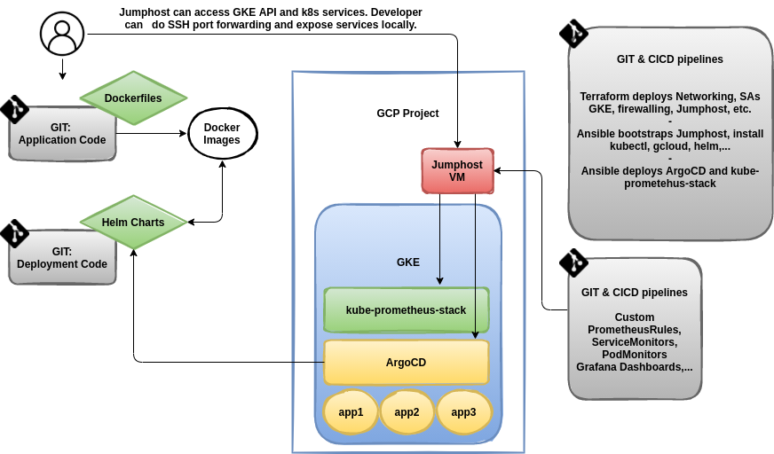

# gke-deployer
This project deploys GKE and additional components to GCP using [GitHub Actions](.github/workflows/gke-deploy.yaml) or alternatively [Azure DevOps Pipelines](docs/azure-devops.md) supported by Terraform and Ansible.
[Jumphost](docs/jh.md) is equipped tooling as kubectl, Helm, [ArgoCD](docs/argocd.md) and sample k8s manifests.
Both GKE and Jumphost are pre-configured to deliver logs and metrics to GCP Cloud Logging and Cloud Monitoring.

Project assumes private GKE cluster not exposed to the external world. However GKE setup is preconfigured to permit external access to API Server on demand by running `gcloud container clusters update CLUSTER --master-authorized-networks CIDR` or by updating respective Terraform variables. Documentation and provsioning code reflect GKE isolation. Normally many things could be done easier for public GKE cluster.


## Architecture


## Prerequisites
Projects assumes existing GCP projects (limitation of the GCP Free Tier).
1. create GCP project, e.g. `workload-318005` with activated billing and few APIs:
```
gcloud beta billing projects link PROJECT_ID --billing-account=BILLING_ACCOUNT
gcloud services enable \
  cloudresourcemanager.googleapis.com \
  secretmanager.googleapis.com
```
2. create GCP Service account (SA) and store SA JSON file.
3. create GCP Cloud Storage for tfstate in the Workload project
```
gsutil mb -p workload-318005 -c standard -l europe-central2 -b on gs://tfstate_PROJECT_ID_gke-deployer
```
4. create GitHub Actions Secret `GCP_SA`. Remove new lines before importing JSON file to the GitHub UI.
```
jq -c . GCP_SA.json
```
5. create GitHub Actions Secret `GCP_SSH_PRIVATE_KEY` for Jumphost access. GitHub actions support multiline variables. Not the case of Azure DevOps. Anyhow consider storing multiline variables as base64 encoded strings and decode when using in the pipeline.

## Deployment
1. Deploy GKE and components using [GitHub Actions](.github/workflows/gke-deploy.yaml) or alternatively [Azure DevOps Pipelines](docs/azure-devops.md).
2. Deploy Argo CD Application manifest towards you application.
3. Infrastructure logging and monitoring work out of the box. Application monitoring using `kube-prometheus-stack` needs configuring custom ServiceMonitors and/or PodMonitors as used [here](https://github.com/jkosik/kube-prometheus-stack).


## Running CICD and git branch management
Branches are organized as `dev/stage/prod`. Branch name is passed to `INFRA_ENV` variable within CICD workflow. Based on `INFRA_ENV` variable Terraform decides which *.tfvars file to use. Ansible utilizes the same variable as well.

## TODO
- Terraform `import` updates only the state file. Add configuration block to TF, otherwise be ready that imported object will be delete on TF apply.
- Application monitoring not deployed yet in Free Tier setup. Include e.g. https://github.com/jkosik/kube-prometheus-stack to the stack and define process - who will deploy and customize alerts? App developers or infra team?

## Additional info
#### Production architecture
In production, consider building Master GCP Project to create and manage workload GCP Projects and workload SAs. Normally Master GCP Project would contain SA for running Terraform provisioning of the workload GCP Projects and resources within. GCP Free Tier does not allow SA to create other GCP Projects. Workaround is to precreate workload GCP Project and workload SA in advance manually.
ClusterAPI project could be a long-term way to go though - Management CAPI cluster in every public cloud to deploy and bootstrap K8S clusters there.

#### Secrets management
This project uses [SealedSecrets](docs/sealed-secrets.md). SealedSecrets controller is deployed to GKE and [GKE specifics](https://github.com/bitnami-labs/sealed-secrets/blob/main/docs/GKE.md) are configured during the provisioning phase. `kubeseal` client is preconfigured on the [Jumphost](docs/jh.md). SealedSecrets support also offline sealing and "bring your own certificates" - consideration for multicloud and private clouds.

#### GKE Deployment using gcloud
Instead of Terraform you can use `gcloud` powered deployment pipeline. Update `other/gke-deploy-gcloud/gke.vars` and run [gke-deploy-gcloud/deployment-local.sh](other/gke-deploy-gcloud/deployment-local.sh) to build GKE from the console. Optionally use [GitHub Actions](other/gke-deploy-gcloud/.github/workflows/gke-deploy-gcloud.yaml).

#### GCP side notes
- `--region` creates HA cluster. `--zone` creates zonal non-HA GKE.
- `export GOOGLE_CREDENTIALS=GCP_SA.json` is sufficient for Terraform. Gcloud needs `gcloud auth activate-service-account...`

#### Dynamic inventory
For more complex usecases use dynamic inventory for GCP and parse output if needed:
```
ansible-galaxy collection install google.cloud
ansible-inventory -i inventory-dynamic-gcp.yaml --list
ansible -i inventory-dynamic-gcp.yaml all -m ping
```


